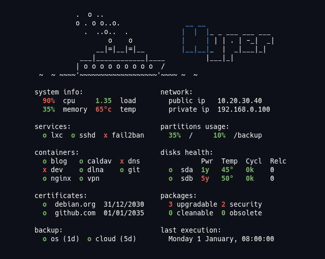

# Tinymotd

Tinymotd generate a configurable dynamic motd via shell script

## Features

* Easy configuration and customisation
* Tiny (<100kb) optimized scripts
* Minimal dependencies
* Many widgets: docker, lxc, apt, pacman, certificates, disks, ...

## Demo

## Setup

### Automated 

The automated install use systemd timer or cron and bashrc.  
To install this, with root rights:

* Clone the repo
* Install: `./install -u <user>`
* Configure layout: `vim ./config`
* Configure widgets: `vim ./widgets/<widget-name>`
* Run interactively: `./generate`

The script runs:
* every hour for system information (cpu, disks, ...)
* every day for other information (certificates, packages, ...)

### Manual

To install manually, with root rights:

* Clone the repo
* Configure layout: `vim ./config`
* Configure widgets: `vim ./widgets/<widget-name>`
* Run interactively: `./generate`
* Generate a static motd file: `./generate > ./data/motd`
* Use the jobs scheduler of your choice to regenerate motd (for instance systemd timer or cron) 
* Add a print of your motd file at login (for instance in `~/.bashrc`) 

